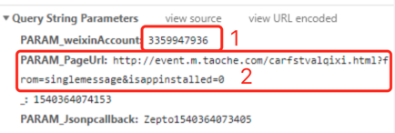

# H5页面在微信中的分享

### 依赖

```javascript
import wxBridge from 'wx-bridge'    // 微信分享
import tools from 'yx-utils';

const weixin = {
    config: {
        authorizationUrl: `//www.taoche.com/zt/Authorize.aspx?lgurl=${encodeURIComponent(window.location.href)}`,
        userInfo: localStorage.getItem('WEIXIN_USER_INFO'),
        getSignatureApi: '//zt.taoche.com/zt/api/WXUserInfor/GetSignature',
    },

    isWeixin: function() {
        const ua = window.navigator.userAgent.toLowerCase();
        if (ua.match(/MicroMessenger/i) === 'micromessenger') {
            return true;
        } else {
            return false;
        }
    },

    getQueryString: function(name) {
        const reg = new RegExp(`(^|&)${name}=([^&]*)(&|$)`, 'i');
        const r = window.location.search.substr(1).match(reg);
        if (r) {
            return decodeURIComponent(r[2]);
        }
    },

    // 微信授权
    getUserInfo: function() {
        if (this.config.userInfo) {
            return this.config.userInfo;
        } else {
            let user = this.getQueryString('v');
            if (user) {
                localStorage.setItem('WEIXIN_USER_INFO', user);
                return user;
            } else {
                window.location.href = this.config.authorizationUrl;
            }
        }
    },

    // 微信分享
    setShare: function(options) {
        $.ajax({
            url: this.config.getSignatureApi,
            type: 'post',
            cache: false,
            async: false,
            data:{
                PARAM_weixinAccount: '3359947936',
                PARAM_PageUrl: window.location.href.split('#')[0]
            },
            dataType: 'jsonp',
            jsonp: 'PARAM_Jsonpcallback',
            success: res => {
                if (res.status === 1) {
                    const signature = res.Data.Signature.split('|');
                    window.__WX_AUTH__ = {
                        debug: false,
                        ...options,
                        appId: 'wx7a2a1b717bdec6cd',
                        signature: signature[0],
                        timestamp: signature[1],
                        nonceStr: 'PbDwGEEc58uPL559',
                        jsApiList:['onMenuShareTimeline', 'onMenuShareAppMessage', 'onMenuShareQQ', 'onMenuShareWeibo']
                    };
                    // console.log(window.__WX_AUTH__);
                    wxBridge();
                }
            },
            error: function(err) {
                console.log(err);
            }
        });

        // taoche系app分享用方法
        window.customizewebconfig = function customizewebconfig() {
            return JSON.stringify({
                shareTitle: options.title,
                shareContent: options.desc,
                shareImg: options.imgUrl,
                shareurl: options.shareUrl,
            })
        };

        if(tools.isWebView()) {
            tools.jsNativeBridge("showShare", {
                title: options.title,
                des: options.desc,
                img: options.imgUrl,
                url: options.shareUrl
            });
        }
    },

    // 获取app分享链接
    getAppShareUrl: function(options) {
        const appInfo = tools.isWebView();
        let baseUrl = '';
        switch (appInfo) {
            case '5':
                // 淘车二手车app
                baseUrl = 'bitautousedcar:';
                break;
            case '108':
            case 'yixintcapp':
                // 淘车app
                baseUrl = 'yixintaoche:';
                break;
            default:
                break;
        }
        if (baseUrl) {
            return encodeURI(`${baseUrl}//?platform=web&action=openShareController&title=${options.title}&content=${options.desc}&shareURL=${options.shareUrl}&imageURL=${options.imgUrl}`);
        } else {
            return false;
        }
    }
};

export default weixin;

```

### 调用

```javascript
    import weixin from 'weixin.js';

    const shareOption = {
        title: '首付1万月租666，买车比买包还轻松！',
        desc: '淘车新车30款热销车型特惠，总价最高直降2.2万，首付1万就开走！',
        imgUrl: 'http://img1.yixinfinance.com/taoche/activity.m/kzbth/images/share.jpg',
        shareUrl: window.location.href
    };
    weixin.setShare(shareOption);
```

### 调试

1.测试环境暂不支持查看该项功能，需灰度环境查看

2.在控制台中查看是否有GetSignature请求，成功发起请求说明调用成功

3.分享还是不成功,查看GetSignature请求参数，根据下图排查，查看1框中是否有更新，2框中的url公众号是否配置；
具体问题需@余波 配合



#### 注意

该功能在分享到朋友圈只取到 shareOption.title ；暂不支持title和desc都在朋友圈展示。


