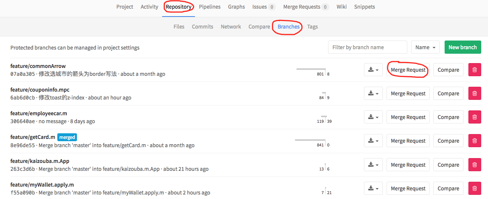
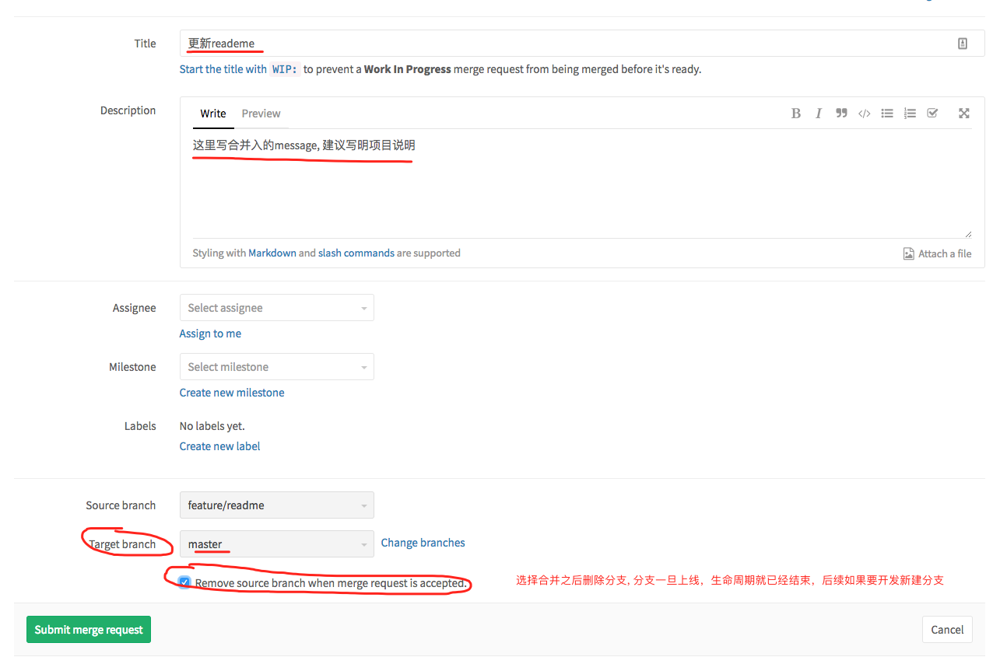
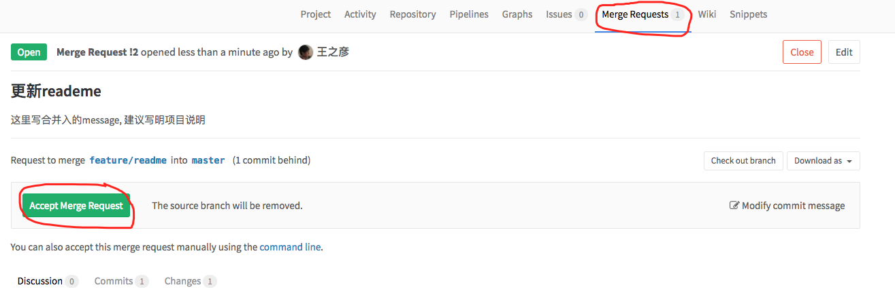

# taoche及feprogram项目上线流程

### `npm run build` 与 `npm run release`

* `npm run build` 为本地开发使用，本地构建
* `npm run release` 供灰度/上线使用，远程构建

### [taoche项目]流程
1. 本地开发完成，将最新master分支合并到当前分支并push
2. 执行`npm run release xxx`远端构建并发布到灰度环境
3. gitlab提merge request(pr)， 申请将开发分支合并到master
4. 管理员review代码，之后accept该次pr到master
5. 管理员根据该次pr最后一次release(build)上线

### gitlab中操作pr

1.申请pr:

2.填写pr说明:

3.仓库负责人review pr， 确认合并

### 其他项目与taoche主项目区别
* 部分项目如crm等项目是全量构建，无需管理员手工上线，pr合并入master即会自动进行远端构建及上线
* 部分敏捷开发项目，如act, 不锁定master权限，开发人员release后即上线

