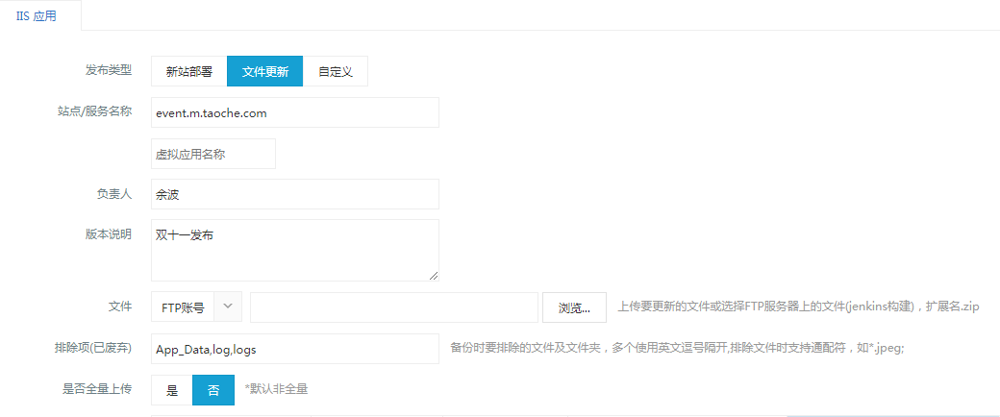
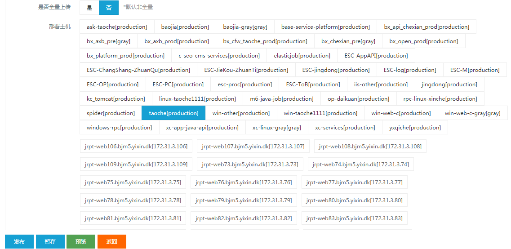

# 淘车活动专题相关处理

## 一．获取二手车车源接口

> 二手车车源接口获取ES文档地址：
> http://192.168.156.232:8090/pages/viewpage.action?pageId=5113356

### 1.接口名称
主接口地址：
```javascript
http://zt.taoche.com/zt/api/GetCarList/GetCarData
```
调用地址：
```javascript
http://zt.taoche.com/zt/api/GetCarList/GetCarData?25748231628663465%27%27&PARAM_DealerId={0}&PARAM_PageSize={1}&PARAM_CurrentCityID={2}&PARAM_CommonFlag={3}&PARAM_IsDESC={4}&PARAM_IsNeglect={5}&PARAM_OrderBy={6}&PARAM_PageIndex={7}&PARAM_PictureCount={8}&PARAM_RequestSource={9}&PARAM_UcarStatus={10}&PARAM_ShowColumn={11}
```

### 2.参数介绍
- {0}：经销商ID,多个可用逗号分割。
- {1}：返回条数，当前城市下经销商ID数量<4时，返回9条。>=4时返回4条。
- {2}:城市ID
- {3}：车源检索规则，详见ES文档地址。
- {4}:排序规则
- {5}:审核：1是 0否
- {6}:按哪个字段排序
- {7}:页码
- {8}:是否有车源图片
- {9}:车源来源
- {10}:车源状态
- {11}:返回字段

### 3.调用方式
参数按照上述格式组合后通过GET方式调用。

### 4.返回信息
按照2中的返回字段定义规则返回指定字段信息。

## 二．通用留资接口 ##

### 1.接口名称 ###
    /base/SaveActivity

### 2.参数介绍 ###
- 姓名：UserName
- 性别：Sex
- 电话：Telephone   (必填)
- 车系：CarSerial   (如果有单个手机号每天只能留资一次的验证，此值不能为空。)
- 省份：Province
- 城市：City
- 区县：County
- 经销商名称：Dealer
- 预计购车时间：BookDate
- 地址：Address
- 业务类型：BusinessFlag   (必填，特殊逻辑下后端研发提供此值，非特殊逻辑填写：500)
- 拓展字段1：Extend1
- 拓展字段1：Extend2
- 拓展字段1：Extend3
- 拓展字段1：Extend4
- 拓展字段1：Extend5
- 拓展字段1：Extend6
- 拓展字段1：Extend7
- 拓展字段1：Extend8
- 拓展字段1：Extend9
- 拓展字段1：Extend10

> 备注：以上字段为活动专题留资全部字段，不是全必填的。按照具体活动传对应值即可。

### 3.调用方式 ###
POST

### 4.返回信息 ###
    {"Result":true,"Message":"保存成功！","Data":"","RowCount":0}
或

    {"Result":false,"Message":"保存失败！","Data":"","RowCount":0}

## 三．通用获取手机验证码接口 ##
### 1.	接口名称 ###
    /base/CheckSign
接口说明：

    CheckSign(string mobile, string captype, string ticket, int businessid = 1001, int line = 550)

### 2.	参数介绍 ###
     mobile电话号，line:550

### 3.	调用方式 ###
POST

### 4.	返回信息 ###
    {"Result":false,"Message":"失败","Data":-2,"RowCount":0}
或：

    {"Result":true,"Message":"设置成功!","Data":1,"RowCount":0}
只要返回Data>0的，表示成功。<0的表示失败，前端页面弹出Message即可。


## 四．	通用获取当前用户登录态接口 ##
### 1.	接口名称 ###
    /base/GetCommonStatus
### 2.	参数介绍 ###
无
### 3.	调用方式 ###
GET
### 4.	返回信息 ###
     {"Result":true,"Message":"","Data":{"IsLogin":true,"UserName":"手机用户8764","Telephone":"13520938764"},"RowCount":0}
     
或

    {"Result":true,"Message":"","Data":{"IsLogin":false,"UserName":"","Telephone":""},"RowCount":0}

## 五．	通用获取当前服务端时间接口 ##
### 1.	接口名称 ###
    /base/GetTime
### 2.	参数介绍 ###
无
### 3.	调用方式 ###
GET
### 4.	返回信息 ###
      {"Result":true,"Message":"","Data":"2018-11-15 11:48:46","RowCount":0}


## 六．	通用登录接口 ##
### 1.	接口名称 ###
通过调用个人中心站点接口实现登录

    PC:  http://home.taoche.com/user/CreateAccount
    M:   http://home.m.taoche.com/user/CreateAccount

测试环境：

    PC：http://test.home.taoche.com/user/CreateAccount
    M：http://test.home.m.taoche.com/user/CreateAccount

### 2.	参数介绍 ###
> 参考URL:http://event.taoche.com/db112018.html(双十一专题)
### 3.	调用方式 ###
> 参考URL:http://event.taoche.com/db112018.html(双十一专题)
### 4.	返回信息 ###
> 参考URL:http://event.taoche.com/db112018.html(双十一专题)


## 七．	发布系统使用 ##
### 1. 发布包处理 ###
前端发布：将静态页面如xxx.html压缩为xxx.zip文件。
后端发布：将发布包如bin文件夹压缩为xxx.zip文件。
### 2. 通过发布站点上传 ###
登录：http://172.31.5.1:2001/  站点[将为相关人申请发布账号]，
选择活动专题站点 PC：event.taoche.com
M:event.m.taoche.com,
对应huidu环境的名称为：
PC：event.huidu.taoche.com
M:event.huidu.m.taoche.com
选择部署主机为：taoche[production],点击“发送”即可，大约3分钟左右可发布完毕。
如下图所示：


